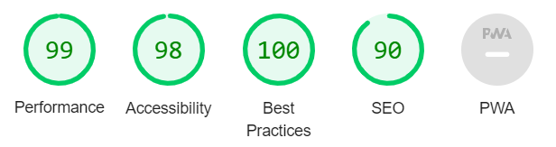

# __The Number Guessing Game__

Welcome to the Number Guessing Game website! This website is specially designed to be easy to use, intuitive and fun! This website has been written using the 3 main pillars of the web, namely HTML, CSS and Javascript. The game takes a random number between 1 and 500. To you the task to figure out which number it is! You only have 10 attempts though.... Good luck!

## __Features__

In this chapter, I will go over the Number Guessing Game existing features and future features that still need to be implemented.

### __Existing features__

- __The Number Guessing Game logo and heading__
  
Featured at the top center of the page, the Number Guessing Game logo and heading are easy to read due to the larger font size and it describes in just 3 words what the website is about. The logo itself is positioned left of the header text and was found on google using the search term: 'numbers'.

- __The Game area__
  
Just below the header and logo of the Number Guessing Game website, you'll find the actual game area of the website. It's just like the header and logo positioned in the center of the website and consists of 3 areas.
 - The text label asking you to 'guess a number
 - The input area asking you to fill in a number between 1 and 500
 - The submit button to check your number. The submit button is both operable by clicking it using your mouse as well as using the 'enter' key on your keyboard.

- __The result area__

The result area is initially not visible on the website, although the space for this area is already reserved just below the game area. The result area becomes visual after submitting your first attempt. The result area consists of the following 3 elements:
  - Information area, that shows you if your answer was wrong or right. The wrong answer is colored red, and the right answer is colored green. 
  - Hint area, that shows you whether your guessed number is too low or to high. Using this information, you can narrow down the range of possible right answers.
  - The attempted numbers area. This area shows you your previous attempted numbers, so you won't forget the numbers you already used so far.

  

- __The reset area__

The reset area only becomes visible after your game is over. The game is over after not guessing the right number within 10 attempts or after succeeding to guess the right number. Your input field and submit button will both be disabled when the reset area becomes visible. The reset area consists of the following 3 elements:
  - Information area, that shows you this time whether the game is over unsuccesfully (in red) or succesfully (in green).
  - The attempted numbers area. Your previously attempted numbers will still be visible.
  - The reset button. A new button will appear to reset the game and start right at the beginning.

  
  

- __The footer area__

The footer consists of 2 buttons:
  - The 'back to game!' button 
  - The 'how to play?' button 

Both buttons are styled in such a way that the text is clearly readible and while hovering over them with your mouse, a line will appear under them. When clicking on the 'how to play?' button, a new screen opens where the rules of the game are described. 

### __Features left to implement__

  - Different levels. For example by implementing less attempts or a greater range of numbers.
  - App version for Android and iOS.

## __Testing__

The Number Guessing Game website has been tested on multiple web browsers installed on multiple devices. In this chapter, I'll explain the features that I've tested and the outcome of the tests. Any interesting highlights (bugs, problems, etc.) that I found will be discussed here as well.

For the tests, I used both a Lenovo Ideapad 340 laptop and a Samsung Galaxy S21FE Android smartphone. The browers installed on the laptop are Chrome Version 104.0.5112.81, Firefox Version 103.0.1 and Edge Version 104.0.1293.47. The browsers installed on the smartphone are Chrome Version 103.0.5060.129, Firefox Version 103.1.0 and Opera Version 70.3.3653.66287. All of these browsers are considered the latest updates at the time of writing (08/08/2022). 

Chrome (desktop)

- All buttons work using the mouse. Also the submit button works using the 'enter' keyboard key.
- Typing of numbers in input field is possible.
- While hovering over the footer buttons, an underline appears.
- Using the 'how to play?' page works.
- Using the 'get back to game!' page works.
- Result area appears including all properties.
- Reset area appears including all properties.
- All tests have been repeated up until a screen width of 300 pixels using the inspect option.

Firefox and Edge have been tested the exact same way and have the exact same outcome. For that reason, I won't list the same items once again. The only difference was the loading speed in Edge which was noticably slower.

Chrome (mobile)

- All buttons work.
- typing the numbers in input field is possible. Numbers keyboard appears automatically.
- While clicking the footer buttons, the underline appears for a short moment under the text.
- Using the 'how to play?' page works.
- Using the 'get back to game!' page works.
- Result area appears including all properties.
- Reset area appears including all properties.
- Everyting looks well balanced and centered.

Just like on the desktop, the testing went exactly the same in both other browsers.

### __Validator testing__

#### HTML
  - Initially, some errors were found but nothing major. I changed a 'for' attribute to meet the requirements and changed a section element to become a div element.  
  - After doing these changes, no errors were returned when passing through the official HTML validator https://validator.w3.org/  
#### CSS
  - Initially, some errors were found but again nothing major. Removed the display: hidden; property because it doesn't seem to exist. 
  - After doing these changes, no errors were returned when passing through the official CSS validator https://jigsaw.w3.org/
#### JS
  - Initially, some errors were found but again nothing major. I forgot a semicolon somewhere in the code and declared some unused variables.
  - After doing these changes, no errors were returned when passing through the official JS validator https://jshint.com/
  - Metrics:
    - There are 4 functions in this file.
    - Function with the largest signature take 1 arguments, while the median is 0.
    - Largest function has 20 statements in it, while the median is 10.
    - The most complex function has a cyclomatic complexity value of 6 while the median is 2.5.
  - Remaing warning: 	'let' is available in ES6 (use 'esversion: 6') or Mozilla JS extensions (use moz).
#### Lighthouse
  - All pages have been tested both for the desktop version as the mobile version. Overall, the desktop version performed superior over the mobile version but both were sufficient. The picture below shows the result of the home page desktop version test.

### __Unfixed bugs__

 - The 'Enter' key does not function for the reset ('start a new game') button and can only be clicked by mouse. Even with help from a tutor, we didn't manage to get this to work.
 - The game will be reset after clicking the 'how to play?' button and after that, going back to the game using the 'back to game!' button. It took me a day to figure out how to solve this and I couldn't find a solution.

## __Deployment__
- The site was deployed to GitHub pages. The steps to deploy are as follows:
  - In the GitHub repository, navigate to the Settings tab.
  - From the pages side menu, select the 'main' branch source'.
  - Once the main branch source has been saved, the page will be automatically refreshed with a detailed ribbon display.
  - indicate the successful deployment.
The live link can be found here: https://jve89.github.io/portfolio2/

## __Credits__

I used multiple sources for my inspiration for this project. Initially, I wanted to imitate a website that i've seen before that tells you if the weather is good enough to wear shorts. This seemed to be a couple steps too far as it needs to fetch the live weather from somewhere. My mentor thought it was a good idea and we did some research on it. After a while, I started to not believe in this project anymore and moved away from it.

I started again to search google for beginner javascript projects and found some of the usual stuff, like a calculater, timer, to-do list and unit converter. All of this seemed nice but the Number Guessing Game caught my attention right away. I found this idea through google who linked me to the website of 'Udemy'. This is a website that provides courses in whatever topic, so it's a no-brainer to look around here as well. Here I found a course called  '17 complete javascript projects explained step by step' made by 'Bluelime Learning Solutions' that explained multiple ideas for beginner javascript projects, and there it was. The inspiration for the Number Guessing Game was born!

For research, I used the following websites:
- https://www.w3schools.com/ (very useful website where you can search for code properties and how to use them)
- https://developer.mozilla.org/ (Does the same as the website mentioned above)

I also got information from Youtube. My favorite used youtube channels are as follows:
- Programming with Mosh
- Web Dev Simplified
- freeCodeCamp.org

The font that I used is called: 'Josefin Sans' and came from Google fonts and the Nummber Guessing Game logo came from the website 'poki.com'.

## __Epilogue__

Thank you for taking the time to read through this README, my code and of course the end result of the Number Guessing Game website. I hope you find the end result inspiring as well!

